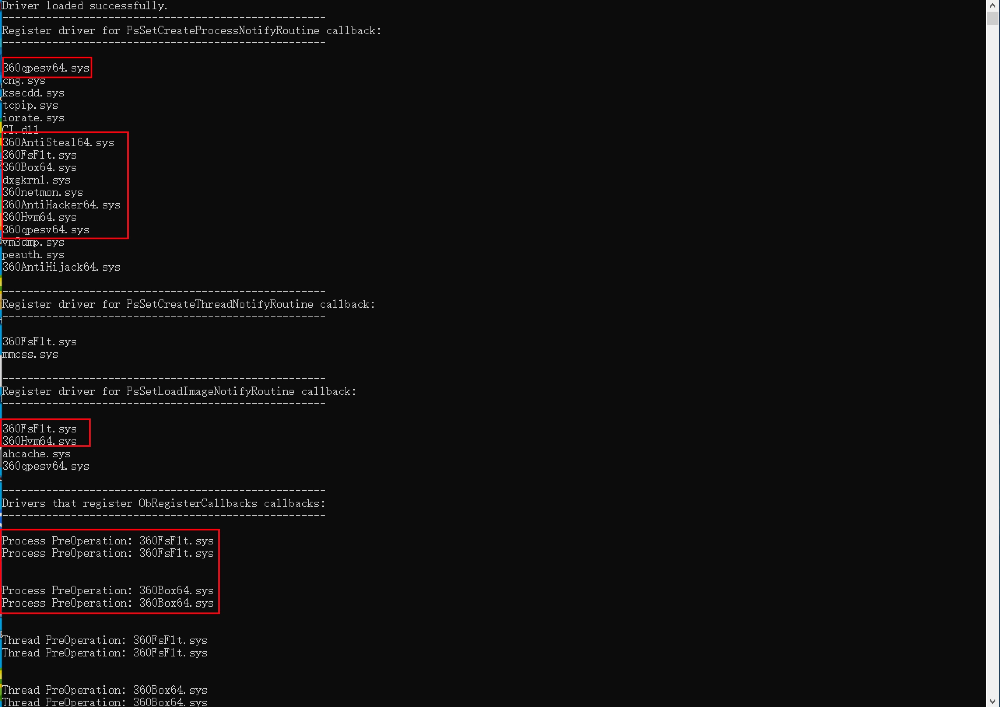
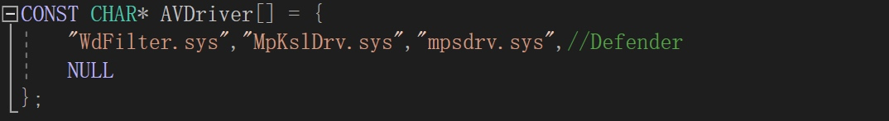
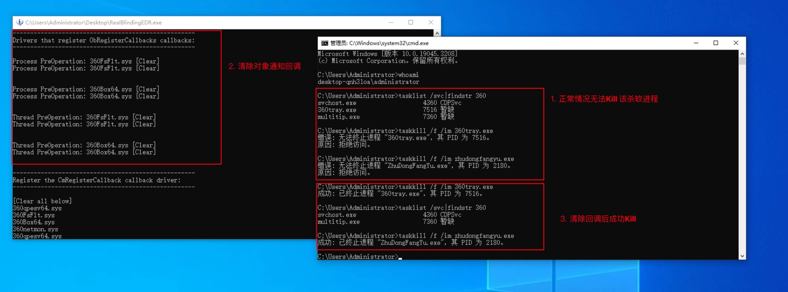
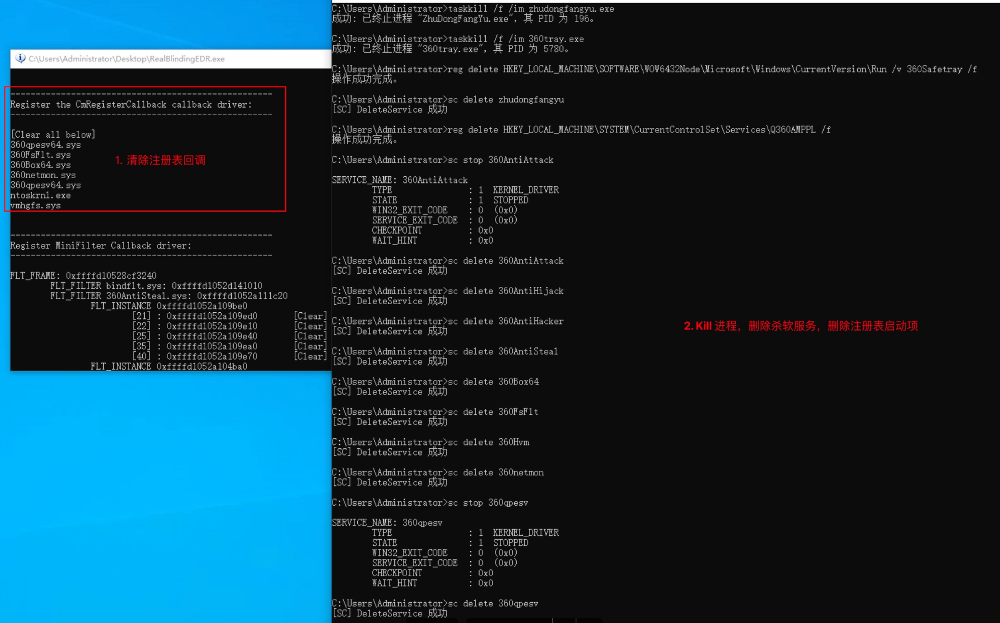
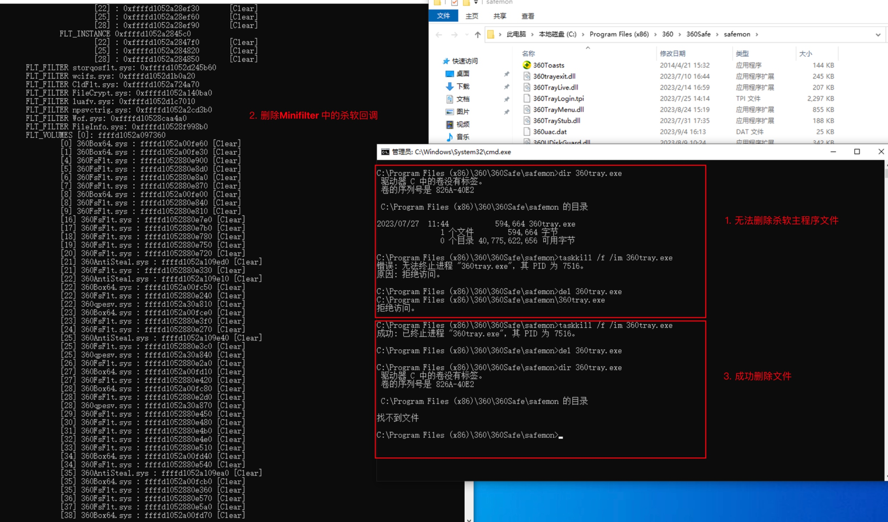

# RealBlindingEDR

利用带签名驱动的任意地址读/写实现：完全致盲、或杀死、或永久关闭 AV/EDR。

如果你想了解实现原理可以参考分析文章：[AV/EDR 完全致盲 - 清除6大内核回调实现](https://mp.weixin.qq.com/s/ZMTjDMMdQoOczxzZ7OAGtA)    [欢迎关注此公众号]

**当前已在64位的 Windows 7/10/11、Windows Server 2008R2/2012R2/2016/2019/2022 完成测试。如果你发现在某个版本有问题，可通过issue 反馈，我会进行适配。**

## 简介

本项目实现了以下内核回调的清除：

1. 删除 `CmRegisterCallback(Ex)` 注册的回调
2. 删除 `MiniFilter微过滤器驱动`注册的回调
3. 删除 `ObRegisterCallbacks()` 注册的回调
4. 删除 `PsSetCreateProcessNotifyRoutine(Ex)` 注册的回调
5. 删除 `PsSetCreateThreadNotifyRoutine(Ex)` 注册的回调
6. 删除 `PsSetLoadImageNotifyRoutine(Ex)` 注册的回调

**删除内核回调后，最终可实现以下3点效果：**

1. **致盲 AV/EDR**
    
    在保持AV/EDR 进程正常运行的情况下，使其无法监控任何进程/线程活动、任何文件落地、注册表删改、高权限句柄获取等众多敏感行为。（不直接Kill 是为了保证EDR 与总控保持通信，避免掉线导致被发现）
    
2. **永久关闭或禁用 AV/EDR**
    
    由于删除了注册表和微过滤器内核通知回调，可以修改注册表或直接删除AV/EDR 文件的方式永久关闭AV/EDR（即使系统重启）。
    
3. **Kill AV/EDR 进程**
    
    由于删除了对象句柄通知回调，现在能够以普通管理员用户权限结束AV/EDR 进程。

## 免责声明

本项目不针对任何AV/EDR 厂商，代码示例仅用于研究学习，不得进行恶意利用，如有恶意利用与本人无关。

## 使用方式

1. 下载项目代码，打开`RealBlindingEDR.h` 文件，配置可利用驱动所在的绝对路径。
    
	本项目支持两种驱动利用：[dbutil_2_3.sys](https://www.loldrivers.io/drivers/a4eabc75-edf6-4b74-9a24-6a26187adabf/) 、[echo_driver.sys](https://www.loldrivers.io/drivers/afb8bb46-1d13-407d-9866-1daa7c82ca63/)
    
    `#define DriverType 1`  表示使用echo_driver.sys
    
    `#define DriverType 2`  表示使用dbutil_2_3.sys
    
    `#define DrivePath "driver_fullpath"`  用于指定驱动所在路径
    
    dbutil_2_3.sys 驱动支持win7及以上版本。
	 
	 echo_driver.sys 驱动支持win10及以上版本。
	 
	 **注意：** 目前这两个驱动在最新版Win11[10.0.22621.2506]上都已无法加载（证书被吊销,Error：c0000603）
	 
2. 编译项目并在安装有AV/EDR 的电脑上双击执行。(如果文件不免杀，请自行编写免杀的shellcode 加载器，然后将其转换成shellcode 后加载)
3. 执行后你会看到下面的效果：（列出了注册这些回调的所有驱动名称）
	
    

4. It's not over yet. You need to open the `RealBlindingEDR.h` file again, find out the driver name of AV/EDR in the output result of step 3 (you can judge it through Google or search local files), and add it to `CONST CHAR* AVDriver[ ] = {}` in the array.

    An example of configuring the Defender driver:
    
      
    **Note:** Be sure not to add the normal driver name of the Windows system to this array, otherwise it may cause the system to crash.
5. Compile again and run it directly to automatically clear all the above callbacks of the specified driver (the name of the driver with deleted callbacks will be followed by a [Clear] flag).
6. If you run it again, you will find that there are no AV/EDR names in these output callbacks.
7. Do what you want.

## 效果
下面演示内容并不针对此AV 厂商，仅出于教育研究目的，绝大多数AV/EDR 厂商都能达到同样的效果。

***Tips:*** 直接执行程序，就可以实现以下所有效果。

[演示视频](Demovideo.mp4)
1. 删除AV/EDR 对象句柄监控，Kill AV进程
	
    
2. 删除AV/EDR 注册表监控，删除AV注册表来实现永久关闭AV
	
    

3. 删除文件落地监控和AV/EDR 自身文件保护，删除AV文件来实现永久关闭AV
	
    

## 待做

1. 清空内核中Windows ETW事件提供者相关句柄。
2. 尝试删除WFP相关回调。
3. ...

## 致谢

***PS:*** 特别感谢我的领导能给我足够的时间去研究，最终才能有此项目。

感谢以下文章和项目，给我思路上的帮助。
1. [OBREGISTERCALLBACKS AND COUNTERMEASURES](https://douggemhax.wordpress.com/2015/05/27/obregistercallbacks-and-countermeasures/)
2. [Windows Anti-Debug techniques - OpenProcess filtering](https://blog.xpnsec.com/anti-debug-openprocess/)
3. [Mimidrv In Depth: Exploring Mimikatz’s Kernel Driver](https://medium.com/@matterpreter/mimidrv-in-depth-4d273d19e148)
4. [Part 1: Fs Minifilter Hooking](https://aviadshamriz.medium.com/part-1-fs-minifilter-hooking-7e743b042a9d)
5. [EchoDrv](https://github.com/YOLOP0wn/EchoDrv)
6. [Windows Kernel Ps Callbacks Experiments](http://blog.deniable.org/posts/windows-callbacks/)
7. [Silencing the EDR. How to disable process, threads and image-loading detection callbacks](https://www.matteomalvica.com/blog/2020/07/15/silencing-the-edr/)
8. [Removing-Kernel-Callbacks-Using-Signed-Drivers](https://br-sn.github.io/Removing-Kernel-Callbacks-Using-Signed-Drivers/)
9. [EchOh-No! a Vulnerability and PoC demonstration in a popular Minecraft AntiCheat tool](https://ioctl.fail/echo-ac-writeup/)

